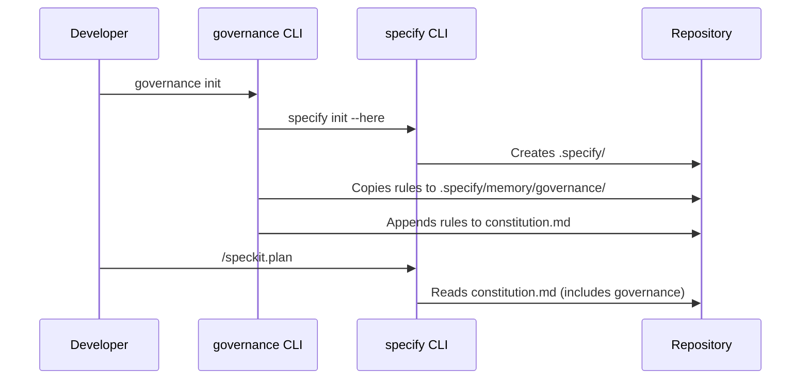

# Technical Specification: Governance-Kit (Spec-Kit Overlay) — MVP

> **Version:** 1.1.0 (Corrected)  
> **Status:** Ready for Implementation  
> **Prerequisites:** uv, Python 3.11+, Git

## 1. Executive Summary

Governance-Kit extends GitHub Spec Kit by injecting organizational governance rules (architecture, stack, process) into its core workflow. It provides a CLI wrapper (`governance`) that:

1. Runs Spec Kit's `specify init` under the hood
2. Appends governance rules directly to `constitution.md`
3. Creates a `governance/` subdirectory in `.specify/memory/` for rule storage

All Spec Kit phases (`/speckit.plan`, `/speckit.tasks`, `/speckit.implement`, `/speckit.analyze`) automatically enforce governance because they reference `constitution.md`.

---

## 2. Architecture

### 2.1 Runtime Flow



### 2.2 Repository Structure

```
governance-kit/
├── pyproject.toml
├── src/
│   └── governance/
│       ├── __init__.py
│       ├── cli.py
│       ├── overlay.py
│       └── rules/              # Bundled with package
│           ├── architecture.md
│           ├── stack.md
│           └── process.md
├── tests/
│   └── test_overlay.py
└── .github/workflows/
    └── ci.yaml
```

---

## 3. Implementation

### 3.1 Package Configuration (`pyproject.toml`)

```toml
[project]
name = "governance-kit"
version = "1.0.0"
description = "Governance overlay for GitHub Spec Kit"
requires-python = ">=3.11"
dependencies = [
    "click>=8.0",
]

[project.scripts]
governance = "governance.cli:main"

[build-system]
requires = ["hatchling"]
build-backend = "hatchling.build"

[tool.hatch.build.targets.wheel]
packages = ["src/governance"]

[tool.hatch.build.targets.wheel.sources]
"src/governance" = "governance"

# Include rules as package data
[tool.hatch.build]
include = [
    "src/governance/rules/*.md",
]
```

### 3.2 CLI Implementation (`src/governance/cli.py`)

```python
"""Governance-enhanced Spec Kit CLI."""
from __future__ import annotations

import subprocess
import sys
from pathlib import Path

import click

from .overlay import apply_governance_overlay


@click.group(invoke_without_command=True)
@click.pass_context
def main(ctx: click.Context) -> None:
    """Governance-enhanced Spec Kit CLI."""
    if ctx.invoked_subcommand is None:
        click.echo(ctx.get_help())


@main.command()
@click.option("--dry-run", is_flag=True, help="Simulate without making changes")
@click.option("--force", is_flag=True, help="Force reinitialize even if .specify exists")
@click.option("--skip-speckit", is_flag=True, help="Skip Spec Kit init (overlay only)")
def init(dry_run: bool, force: bool, skip_speckit: bool) -> None:
    """Initialize repository with Spec Kit + Governance overlay."""
    specify_dir = Path(".specify")
    
    # Step 1: Run Spec Kit init if needed
    if not skip_speckit:
        if specify_dir.exists() and not force:
            click.echo("ℹ️  .specify/ already exists. Use --force to reinitialize.")
        else:
            click.echo("📦 Running Spec Kit initialization...")
            if not dry_run:
                result = subprocess.run(
                    ["specify", "init", "--here", "--force"],
                    capture_output=True,
                    text=True,
                )
                if result.returncode != 0:
                    # Try with uvx if specify not in PATH
                    result = subprocess.run(
                        [
                            "uvx",
                            "--from",
                            "git+https://github.com/github/spec-kit.git",
                            "specify",
                            "init",
                            "--here",
                            "--force",
                        ],
                        capture_output=True,
                        text=True,
                    )
                    if result.returncode != 0:
                        raise click.ClickException(
                            f"Spec Kit init failed: {result.stderr}"
                        )
                click.echo("✅ Spec Kit initialized.")
    
    # Step 2: Apply governance overlay
    if not specify_dir.exists():
        raise click.ClickException(
            ".specify/ not found. Run 'specify init --here' first or remove --skip-speckit."
        )
    
    click.echo("🛡️  Applying Governance Overlay...")
    if not dry_run:
        apply_governance_overlay(specify_dir)
    else:
        click.echo("   (dry-run: no changes made)")
    
    click.echo("✅ Governance overlay applied. Run '/speckit.constitution' to finalize.")


@main.command()
def check() -> None:
    """Check if governance overlay is applied."""
    constitution = Path(".specify/memory/constitution.md")
    gov_dir = Path(".specify/memory/governance")
    
    issues = []
    if not constitution.exists():
        issues.append("❌ constitution.md not found")
    elif "GOVERNANCE OVERLAY" not in constitution.read_text():
        issues.append("⚠️  Governance overlay not in constitution.md")
    
    if not gov_dir.exists():
        issues.append("❌ governance/ directory not found")
    else:
        for rule in ["architecture.md", "stack.md", "process.md"]:
            if not (gov_dir / rule).exists():
                issues.append(f"⚠️  Missing rule: {rule}")
    
    if issues:
        for issue in issues:
            click.echo(issue)
        sys.exit(1)
    else:
        click.echo("✅ Governance overlay is properly configured.")


if __name__ == "__main__":
    main()
```

### 3.3 Overlay Logic (`src/governance/overlay.py`)

```python
"""Governance overlay application logic."""
from __future__ import annotations

import shutil
from importlib.resources import files
from pathlib import Path

# Marker to detect if overlay is already applied
OVERLAY_MARKER = "# --- 🏛️ GOVERNANCE OVERLAY ---"


def get_rules_dir() -> Path:
    """Get the bundled rules directory."""
    return files("governance") / "rules"


def apply_governance_overlay(specify_dir: Path) -> None:
    """Apply governance rules to a Spec Kit initialized repository.
    
    Args:
        specify_dir: Path to .specify/ directory
    
    Raises:
        FileNotFoundError: If constitution.md doesn't exist
    """
    memory_dir = specify_dir / "memory"
    constitution = memory_dir / "constitution.md"
    gov_dir = memory_dir / "governance"
    
    # Validate constitution exists
    if not constitution.exists():
        raise FileNotFoundError(
            f"{constitution} not found. Run '/speckit.constitution' first."
        )
    
    # Check if already applied
    content = constitution.read_text()
    if OVERLAY_MARKER in content:
        return  # Idempotent: already applied
    
    # Create governance directory
    gov_dir.mkdir(exist_ok=True)
    
    # Copy rule files from bundled package data
    rules_source = get_rules_dir()
    for rule_name in ["architecture.md", "stack.md", "process.md"]:
        source = rules_source / rule_name
        if source.is_file():
            shutil.copy(source, gov_dir / rule_name)
    
    # Append governance section to constitution.md
    governance_section = f"""

{OVERLAY_MARKER}

The following governance rules are **non-negotiable** and apply to all development phases.

## Architecture Governance

{(gov_dir / "architecture.md").read_text() if (gov_dir / "architecture.md").exists() else "[Define architecture rules in .specify/memory/governance/architecture.md]"}

## Stack Governance

{(gov_dir / "stack.md").read_text() if (gov_dir / "stack.md").exists() else "[Define stack rules in .specify/memory/governance/stack.md]"}

## Process Governance

{(gov_dir / "process.md").read_text() if (gov_dir / "process.md").exists() else "[Define process rules in .specify/memory/governance/process.md]"}

---
*Governance overlay applied by governance-kit*
"""
    
    with open(constitution, "a") as f:
        f.write(governance_section)
```

### 3.4 Sample Governance Rules

**`src/governance/rules/architecture.md`:**

```markdown
### Architecture Laws

- **MUST** use stateless service design; state persists in managed stores only
- **MUST** separate API layer from business logic (no direct DB calls in handlers)
- **MUST NOT** introduce circular dependencies between modules
- **MUST** design for horizontal scalability
```

**`src/governance/rules/stack.md`:**

```markdown
### Technology Stack Rules

- **MUST** use Python 3.11+ for all backend services
- **MUST** use uv for dependency management
- **MUST** use pytest for testing
- **MUST NOT** use MongoDB, Redis, or other non-approved data stores without approval
- **MUST NOT** add dependencies not in the approved list without justification
```

**`src/governance/rules/process.md`:**

```markdown
### Process Requirements

- **MUST** write tests before implementation (TDD)
- **MUST** pass ruff and mypy before committing
- **MUST** document all public APIs
- **MUST** create OpenAPI spec for any REST endpoints
- **MUST NOT** merge without PR review
```

---

## 4. Installation

### 4.1 Global Installation (Recommended)

```bash
uv tool install git+https://github.com/leonbreukelman/governance-kit.git
```

### 4.2 Project-Local Installation

```bash
uv pip install git+https://github.com/leonbreukelman/governance-kit.git
```

### 4.3 Development Installation

```bash
git clone https://github.com/leonbreukelman/governance-kit
cd governance-kit
uv pip install -e .
```

---

## 5. Usage

### 5.1 New Repository

```bash
# Initialize with Spec Kit + Governance
governance init

# Create constitution via Spec Kit
# (In your AI agent):
/speckit.constitution This is a Python AWS project...
```

### 5.2 Existing Spec Kit Repository

```bash
# Apply overlay to existing .specify/
governance init --skip-speckit

# Or if Spec Kit not initialized yet:
governance init
```

### 5.3 Verify Configuration

```bash
governance check
```

---

## 6. How Enforcement Works

Once applied, governance rules are embedded in `constitution.md`. Spec Kit's commands automatically enforce them:

| Command | Enforcement |
|---------|-------------|
| `/speckit.plan` | Rejects plans violating stack/architecture rules |
| `/speckit.tasks` | Ensures tasks include required process gates |
| `/speckit.implement` | Blocks code that violates governance |
| `/speckit.analyze` | Reports compliance issues in analysis |

The `analyze.md` command template explicitly states:
> "**Constitution Authority**: The project constitution is **non-negotiable**."

---

## 7. CI Integration (`.github/workflows/ci.yaml`)

```yaml
name: Governance Check

on: [push, pull_request]

jobs:
  verify:
    runs-on: ubuntu-latest
    steps:
      - uses: actions/checkout@v4
      
      - name: Install uv
        uses: astral-sh/setup-uv@v4
      
      - name: Install governance-kit
        run: uv tool install git+https://github.com/leonbreukelman/governance-kit.git
      
      - name: Check governance overlay
        run: governance check
```

---

## 8. Definition of Done

- [ ] Repository created with structure above
- [ ] `governance init` works on fresh repo
- [ ] `governance init --skip-speckit` works on existing Spec Kit repo
- [ ] `governance check` validates overlay presence
- [ ] Rules bundled correctly via importlib.resources
- [ ] CI workflow passes
- [ ] End-to-end: `/speckit.plan` rejects banned tech
